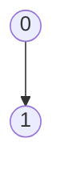

# Phase 2: Visual Reconstruction

**Input:** Existing `resources/claude_analysis/lec-{NUM}.md` (Skeleton)
**Goal:** Enrich the skeleton with high-fidelity ASCII/Mermaid diagrams and specific logical traces.

---

## Step 1: Analyze Visuals per Page

**Instruction:**
Re-visit the images `resources/claude_analysis/L{NUM}/`.
Focus ONLY on:
1.  **Graphs/Grids:** Grid graphs, Trees, Matrices.
2.  **Handwritten Traces:** Number sequences (e.g., `Start: 0 -> 1 -> ...`).
3.  **State Changes:** Changes in Queues, Stacks, or Arrays (Visited).

---

## Step 2: Generate Visual Blocks

For each visual element, create a Markdown block:

**Type A: Mermaid** (For Nodes/Edges, Flowcharts, Trees)


**Type B: ASCII Art** (For Grids, Matrices, Arrays, Queues)
```
[ 0 | 1 | 2 ]
  ^
```

**Type C: Verification Trace** (The "Debugger" View)
- Extract the **exact** numbers written by the professor.
- Format as: `Start Node -> Neighbor 1 -> ...`

---

## Step 3: Inject into Markdown

**Action:** Edit `resources/claude_analysis/lec-{NUM}.md`.
- Replace placeholders (e.g., `[Diagram]`) or append to relevant "Topic" sections.
- Sections to Add/Update:
    - `### Visual Examples (Hand-Drawn Reconstruction)`
    - `### Step-by-Step Algorithm Trace`
    - `### State Visualization`

**Critical Rules:**
- ✅ **Detailed ASCII:** Use box chars (`┌ ┐ │ ─`) for matrices/arrays.
- ✅ **Exact Matches:** The ASCII graph must topologically match the slide.
- ✅ **No Generic Examples:** Use the SPECIFIC graph from the lecture.
