# Lecture 42 - Graphs

**Source:** `L42 - Graphs.pdf`

---

## Topic 1: Introduction to Graphs

### Concept Explanation
- A graph is a **non-linear data structure** that can be thought of as a collection of **nodes** (or vertices) and **edges**
- Formally, a graph is a **pair of sets V and E** where:
  - **V** is a non-empty set of **vertices**
  - **E** is a set of **edges** such that each edge is a pair of vertices
- Notation:
  - `|V|` = number of vertices (often denoted as `n`)
  - `|E|` = number of edges (often denoted as `m`)
  - Number of edges can be 0 to n-1 in a simple graph

### Graph Types

#### Undirected Graph
- Each edge is an **unordered** pair of vertices
- Example: V = {0, 1, 2, 3, 4}, E = {(0,1), (0,2), (1,2), (1,3), (2,3), (2,4), (3,4)}
- Edge (u, v) is the same as edge (v, u)

#### Visual Example (Undirected Graph - 1 Component)

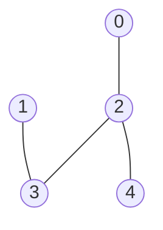

**Vertex & Edge Set:**
- V = {0, 1, 2, 3, 4}, |V| = 5
- E = {(0,2), (1,3), (2,3), (2,4)}, |E| = m = 4

#### Visual Example (Undirected Graph - 2 Components)

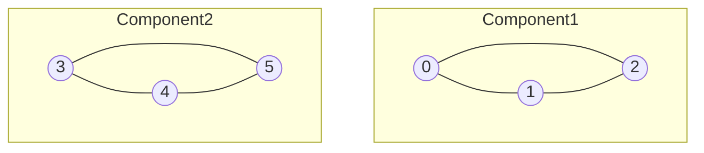

**Vertex & Edge Set:**
- V = {0, 1, 2, 3, 4, 5, 6}, |V| = 7
- E = {(0,1), (0,2), (1,2), (3,4), (3,5), (4,5), (5,6)}, |E| = 7

#### Directed Graph
- Each edge is an **ordered** pair of vertices
- Example: V = {0, 1, 2, 3, 4}, E = {(0,2), (1,0), (1,3), (2,4), (3,2), (4,3)}
- Edge (u, v) is different from edge (v, u)

#### Visual Example (Directed Graph)

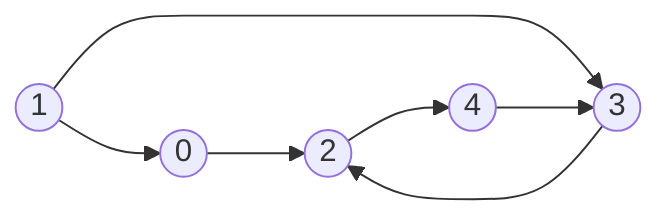

**Edge Set (Directed):**
- E = {(0,2), (1,0), (1,3), (2,4), (3,2), (4,3)}

#### Weighted Graph
- Each edge is assigned a **weight**
- Categories: Weighted vs Unweighted, Directed vs Undirected

#### Visual Example (Weighted Directed Graph)

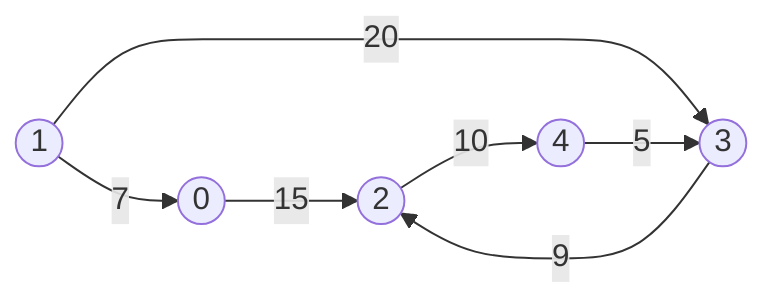

**Edge Set (Weighted):**
- E = {(0,2,15), (1,0,7), (1,3,20), (2,4,10), (3,2,9), (4,3,5)}

---

## Topic 2: Applications of Graphs

### Social Networking Sites
- **Users** can be thought of as nodes in a graph
- **Relationships** (friendships, follows) can be thought of as edges between graph nodes

#### Visual Example (Mentors Network)

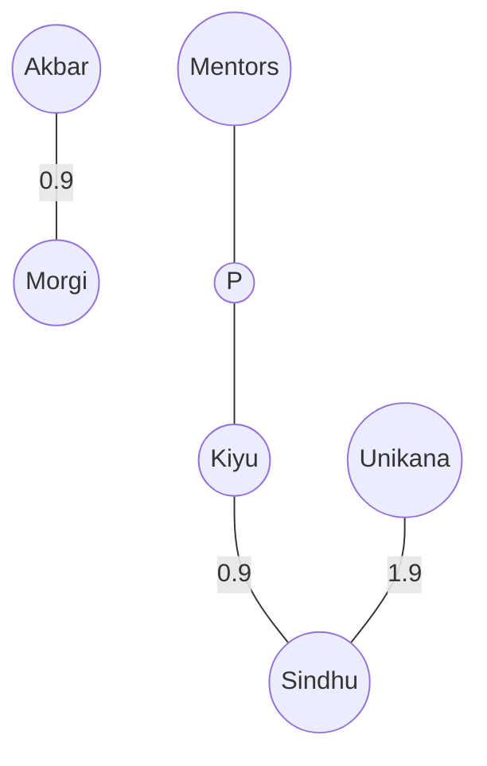

### Maps (of a city)
- **Checkpoints** (locations) can be thought of as nodes in a graph
- **Roads** can be thought of as edges between graph nodes
- Edge weights can represent **distances in miles**

#### Visual Example (City Map)

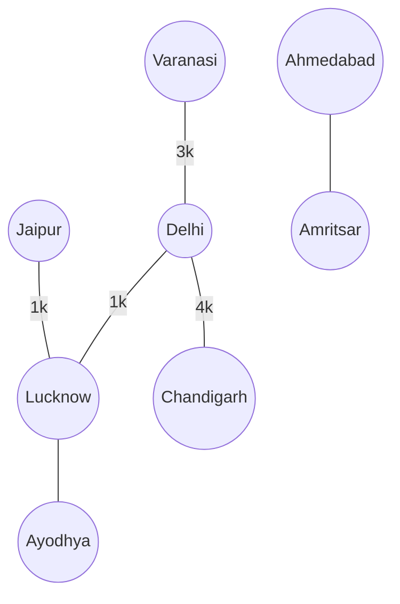

**Distance Representation:**
```
        1 mile
OKY ───────────► OK
 │              │
 │ 5 mile       │ 4 mile  
 ▼              ▼
```

---

## Topic 3: Graph Terminology I

### Adjacent Vertices
- In an **undirected graph**, if there exists an edge between two vertices then they are said to be **adjacent** to each other

#### Visual Example (Adjacency)

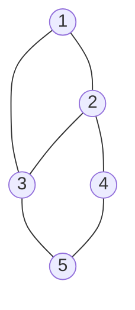

**Adjacency Analysis for vertex 4:**
- d = 3 (degree)
- neighbors(4) = {2, 3, 5}

### Degree of a Vertex
- In an undirected graph, we define **degree** of a vertex as the number of vertices adjacent to it

#### Visual Example (Degree Calculation)

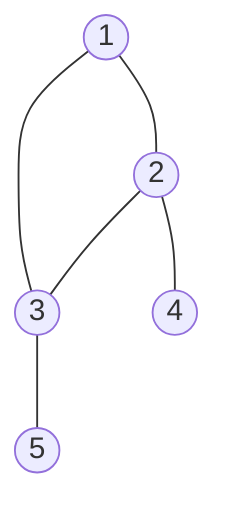

**Degree Table:**
```
┌────────┬────────┐
│ Vertex │ Degree │
├────────┼────────┤
│   1    │   2    │
│   2    │   3    │
│   3    │   3    │
│   4    │   1    │
│   5    │   1    │
└────────┴────────┘
Σ deg = 2 + 3 + 3 + 1 + 1 = 10 = 2|E| = 2×5
```

### In-Degree and Out-Degree (Directed Graphs)

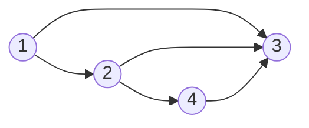

**Degree Table (Directed):**
```
┌────────┬───────────┬────────────┐
│ Vertex │ In-Degree │ Out-Degree │
├────────┼───────────┼────────────┤
│   1    │     0     │     2      │
│   2    │     1     │     2      │
│   3    │     3     │     0      │
│   4    │     1     │     1      │
└────────┴───────────┴────────────┘
```
- **In-degree** = number of incoming edges (predecessors)
- **Out-degree** = number of outgoing edges (successors)
- Sum of all degrees = 2 × |E| (Handshaking Lemma)

### Parallel Edges & Self-Loop

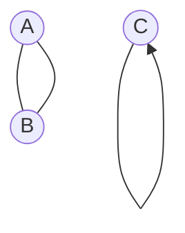

- **Parallel Edges**: Multiple edges between same pair of vertices
- **Self-Loop**: Edge connecting vertex to itself
- **Simple Graph**: No parallel edges or self-loops

---

## Topic 4: Minimum and Maximum Number of Edges

### Empty Graph
- The minimum number of edges in a graph is **0**, such a graph is known as an **empty graph**

### Maximum Edges Formula

**For Undirected Graph:**
```
|E|_max = n(n-1)/2

Example: n = 4
|E|_max = 4×3/2 = 6
```

**For Directed Graph:**
```
|E|_max = n(n-1)

Example: n = 4  
|E|_max = 4×3 = 12
```

#### Visual Example (Complete Graph K4)

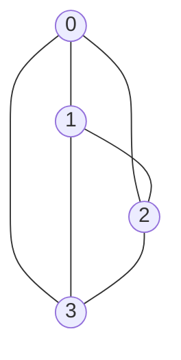

**Complete Graph Properties:**
- Every vertex connected to every other
- |E| ≈ |V|² (for large n)

---

## Topic 5: Graph Representation - Adjacency List

### Concept Explanation
- To represent a graph with |V| vertices and |E| edges using adjacency list:
- Create an **array of size |V|** such that at each index of the array you store a **list of neighbors** that correspond to the vertex mapped to that index

**Instructor Code:**
- [001Graphs_AdjacencyListImpl0.cpp](../../instructor_code/Lecture%2042/001Graphs_AdjacencyListImpl0.cpp) - 0-indexed Implementation
- [001Graphs_AdjacencyListImpl1.cpp](../../instructor_code/Lecture%2042/001Graphs_AdjacencyListImpl1.cpp) - 1-indexed Implementation
- [001Graphs_AdjacencyListImpl2.cpp](../../instructor_code/Lecture%2042/001Graphs_AdjacencyListImpl2.cpp) - Sorted Neighbors (using Set)

**My Practice Code:**
- [DSA_Practice/CB/LEC42](../../user_practice_code/CB/LEC42)
- [1.graph_adj_list.cpp](../../user_practice_code/CB/LEC42/1.graph_adj_list.cpp)
- [2.graph_adj_list_set.cpp](../../user_practice_code/CB/LEC42/2.graph_adj_list_set.cpp)

### Visual Example (Adjacency List)

**Graph:**
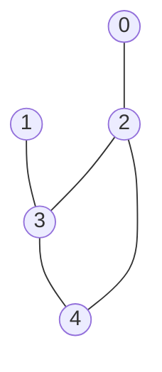

**Logical View (Array of Lists):**
```
Index   Neighbors (Linked List)
┌───┐
│ 0 │ ──► [2]
├───┤
│ 1 │ ──► [3]
├───┤
│ 2 │ ──► [0] ──► [3] ──► [4]
├───┤
│ 3 │ ──► [1] ──► [2] ──► [4]
├───┤
│ 4 │ ──► [2] ──► [3]
└───┘
```

**Internal View (2D Array / Vector of Vectors):**
```
     0    1    2    3    4
   ┌────┬────┬────┬────┬────┐
 0 │  2 │    │    │    │    │
   ├────┼────┼────┼────┼────┤
 1 │  3 │    │    │    │    │
   ├────┼────┼────┼────┼────┤
 2 │  0 │  3 │  4 │    │    │
   ├────┼────┼────┼────┼────┤
 3 │  1 │  2 │  4 │    │    │
   ├────┼────┼────┼────┼────┤
 4 │  2 │  3 │    │    │    │
   └────┴────┴────┴────┴────┘
```

**Implementation Tip:**
- Use `vector<set<int>>` if you want results to always be sorted

### Space Complexity

#### Undirected Graph
```
Total Space = |V| + Σ(deg_i) from i=0 to n-1
            = |V| + 2|E|     (Handshaking Lemma)
            = O(n + 2m)
```

**Visual Breakdown:**
```
┌──────────────────────────────────────────┐
│     |V|     +    Σ deg_i    =   Total    │
│              (each edge counted twice)    │
│                                          │
│      5      +      2×5      =    15      │
│   (array)     (neighbors)      (space)   │
└──────────────────────────────────────────┘
```

#### Directed Graph
```
Space = |V| + |E|
      = O(n + m)
```
- Since Σ(out-deg_i) = |E| (each edge stored once)

---

## Topic 6: Graph Operations (Adjacency List)

### Operations & Complexity

**Given:** Graph with |V| vertices and |E| edges

#### List All Neighbors of a Vertex v
```
Time: O(deg(v))
```

#### Add an Edge Between Vertex u and v
```
Using vectors:     adj[u].pb(v)         → O(1) amortized
Using sets:        adj[u].insert(v)     → O(log(deg(v)))
```

#### Check if Edge Exists Between Vertex u and v
```
Strategy: Go to neighbors of u and search for v (or vice versa)

Using vectors (linear search):
    Time: O(min(deg(u), deg(v)))

Using sets (binary search):
    Time: O(log(min(deg(u), deg(v))))
```

#### Delete an Edge Between Vertex u and v
```
Strategy: 
1. Go to neighbors of u and delete v
2. Go to neighbors of v and delete u

Using vectors:
    Time: O(max(deg(u), deg(v))) or O(deg(u) + deg(v))

Using sets:
    Time: O(log(deg(u)) + log(deg(v)))
```

**Summary Table:**
```
┌─────────────────────┬─────────────────────┬─────────────────────┐
│     Operation       │   Vector (Linear)   │    Set (Sorted)     │
├─────────────────────┼─────────────────────┼─────────────────────┤
│ List neighbors(v)   │     O(deg(v))       │     O(deg(v))       │
│ Add edge (u,v)      │     O(1)            │   O(log(deg))       │
│ Check edge exists   │ O(min(deg(u,v)))    │ O(log(min(deg)))    │
│ Delete edge (u,v)   │ O(max(deg(u,v)))    │ O(log(deg(u,v)))    │
└─────────────────────┴─────────────────────┴─────────────────────┘
```

---

## Topic 7: Adjacency List - Drawbacks & Handling Non-Integer Labels

### Drawbacks
- Current implementation fails when labels assigned to vertices are:
  - Integer values that exceed |V| - 1
  - Non-integer values (like characters)

### Solution: Using Maps

**Graph with Character Labels:**
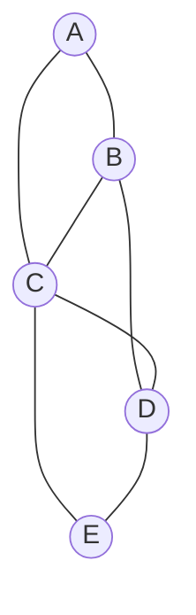

**Map-Based Adjacency List:**
```
Key (char) → Value (vector<char> or set<char>)

A  →  [B, C]
B  →  [A, C, D]
C  →  [A, B, D, E]
D  →  [B, C, E]
E  →  [C, D]
```

**C++ Implementation:**
```cpp
map<char, vector<char>>  // or
map<char, set<char>>
```

**Instructor Code:**
- [003Graphs_AdjacencyListImpl3.cpp](../../instructor_code/Lecture%2042/003Graphs_AdjacencyListImpl3.cpp) - Character Labels (using Map)

**My Practice Code:**
- [DSA_Practice/CB/LEC42](../../user_practice_code/CB/LEC42)
- [3.graph_adj_map.cpp](../../user_practice_code/CB/LEC42/3.graph_adj_map.cpp)

---

## Topic 8: Weighted Graphs - Adjacency List

### Representation
- For weighted graphs, store pairs instead of just neighbors
- Each entry stores (neighbor, weight)

**Instructor Code:**
- [004Graphs_AdjacencyListImpl4.cpp](../../instructor_code/Lecture%2042/004Graphs_AdjacencyListImpl4.cpp) - Weighted Graph Implementation

**My Practice Code:**
- [DSA_Practice/CB/LEC42](../../user_practice_code/CB/LEC42)
- [3.graph_adj_map_weighted.cpp](../../user_practice_code/CB/LEC42/3.graph_adj_map_weighted.cpp)

**Graph:**
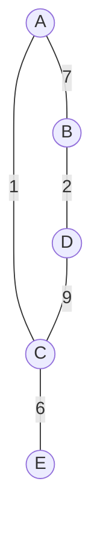

**Adjacency List (Weighted):**
```
Key → Value: vector<pair<char, int>>

A  →  [(B, 7), (C, 1)]
B  →  [(A, 7), (D, 2)]
C  →  [(A, 1), (D, 9), (E, 6)]
D  →  [(B, 2), (C, 9)]
E  →  [(C, 6)]
```

**Internal View (2D with Weights):**
```
       A     B     C     D     E
    ┌─────┬─────┬─────┬─────┬─────┐
  A │     │ B,7 │ C,1 │     │     │
    ├─────┼─────┼─────┼─────┼─────┤
  B │ A,7 │     │     │ D,2 │     │
    ├─────┼─────┼─────┼─────┼─────┤
  C │ A,1 │     │     │ D,9 │ E,6 │
    ├─────┼─────┼─────┼─────┼─────┤
  D │     │ B,2 │ C,9 │     │     │
    ├─────┼─────┼─────┼─────┼─────┤
  E │     │     │ C,6 │     │     │
    └─────┴─────┴─────┴─────┴─────┘
```

---

## Topic 9: Adjacency Matrix

### Concept Explanation
- To represent an **undirected graph** with |V| vertices and |E| edges using adjacency matrix:
- Create a **2D-Array of size |V| × |V|** such that you assign **value one** to cells at (i, j)th index if there exists an edge between vertices labeled as i and j
- **Space: O(|V|²)**

### Visual Example

**Graph:**


**Adjacency Matrix:**
```
        0   1   2   3   4
      ┌───┬───┬───┬───┬───┐
    0 │ 0 │ 0 │ 1 │ 0 │ 0 │
      ├───┼───┼───┼───┼───┤
    1 │ 0 │ 0 │ 0 │ 1 │ 0 │
      ├───┼───┼───┼───┼───┤
    2 │ 1 │ 0 │ 0 │ 1 │ 1 │
      ├───┼───┼───┼───┼───┤
    3 │ 0 │ 1 │ 1 │ 0 │ 1 │
      ├───┼───┼───┼───┼───┤
    4 │ 0 │ 0 │ 1 │ 1 │ 0 │
      └───┴───┴───┴───┴───┘

Space: 5 × 5 = 25 cells
```

### Graph Operations (Adjacency Matrix)

**Given:** Graph with |V| vertices and |E| edges

```
┌─────────────────────────┬─────────────────┬────────────────┐
│       Operation         │ Implementation  │  Time          │
├─────────────────────────┼─────────────────┼────────────────┤
│ Add edge (u,v)          │ mat[u][v] = 1   │ O(1) constant  │
│ Check edge exists (u,v) │ mat[u][v] == 1? │ O(1) constant  │
│ Delete edge (u,v)       │ mat[u][v] = 0   │ O(1) constant  │
│ List neighbors of v     │ scan row v      │ O(V)           │
└─────────────────────────┴─────────────────┴────────────────┘
```

---

## Topic 10: Adjacency List vs Adjacency Matrix

### Space Complexity Comparison
```
┌───────────────────┬─────────────────────┐
│  Representation   │   Space Complexity  │
├───────────────────┼─────────────────────┤
│  Adjacency List   │   O(|V| + |E|)      │
│  Adjacency Matrix │   O(|V|²)           │
└───────────────────┴─────────────────────┘
```

### When to Use What

#### Sparse Graphs (|E| ~ |V|)
```
                    Sparse
                 |E| ~ |V|
                     │
        ┌────────────┴────────────┐
        ▼                         ▼
   Adj. List                  Adj. Matrix
   V + 2E                        V²
   = V + 2V                   
   ≈ O(V) ✓                   O(V²) ✗
```

#### Dense Graphs (|E| ~ |V|²)
```
                    Dense
                 |E| ~ |V|²
                     │
        ┌────────────┴────────────┐
        ▼                         ▼
   Adj. List                  Adj. Matrix
   V + 2E                        V²
   = V + 2V²                  
   ≈ O(V²)                    O(V²) ✓
                         (preferred for O(1) lookups)
```

### Decision Rule
```
┌─────────────────────────────────────────────────────────┐
│  Sparse graph (few edges)    →  Use Adjacency List     │
│  Dense graph (many edges)    →  Use Adjacency Matrix   │
└─────────────────────────────────────────────────────────┘
```

---

## Topic 11: Graph Terminology II

### Walk
- A **walk** in a graph is a **sequence of vertices** such that any two vertices adjacent in the vertex sequence are also adjacent in the graph
- A walk is **closed** if it starts and ends at the same graph vertex

**Visual Example:**
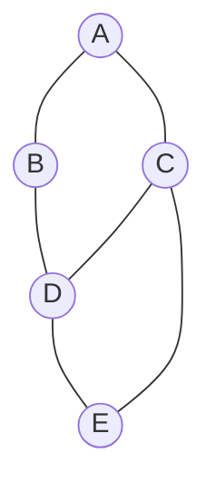

**Walk Examples:**
```
Valid Walk:    A → C → D → E → C → D → B   ✓
Invalid Walk:  A → C → B → D               ✗ (No edge C-B)
Closed Walk:   A → C → D → B → A           ✓ (starts and ends at A)
```

### Path
- A **path** in a graph is a **walk** in which we visit each vertex of the graph at **most once**

**Path Examples:**
```
Valid Path:    A → C → D → E               ✓ (each vertex visited once)
Invalid Path:  A → C → D → B → A → C       ✗ (A and C visited twice)
```

### Cycle
- A **cycle** in a graph is a **closed walk** in which we traverse each graph edge at **most once**
- A graph **without any cycle** is also known as an **acyclic graph**

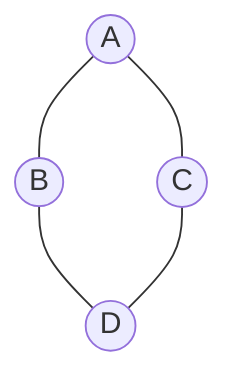

**Cycle Examples:**
```
Valid Cycle:    A → C → D → B → A          ✓
                (closed, each edge used once)

Invalid Cycle:  C → E → D → C → E → D → E  ✗
                (edges used multiple times)
```

### Connected Graph
- A graph is **connected** if there exists a **path** between each pair of graph vertices
- A graph that is **not connected** is known as a **disconnected graph**

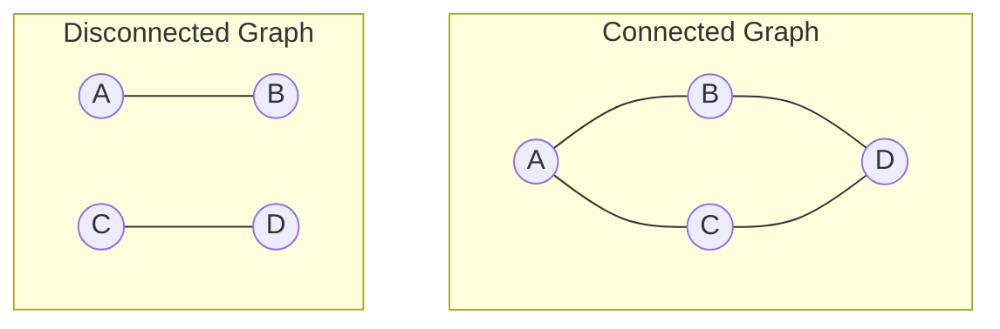

---

## Topic 12: Strongly-Connected Graph

### Concept Explanation
- A directed graph is **strongly-connected** if there exists a **directed path** between each pair of vertices in the graph
- Algorithm: **Kosaraju's Algorithm** for finding Strongly Connected Components (SCC)

**Visual Example:**
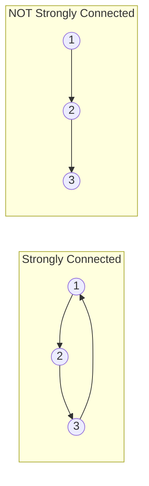

### Weakly-Connected Graph
- A directed graph is **weakly-connected** if there exists a **directed or reversed-directed path** between each pair of vertices
- (i.e., connected if we ignore edge directions)

---

## Topic 13: Sub-Graph

### Concept Explanation
- A **sub-graph** of a graph G = (V, E) is a graph G' = (V', E') such that:
  - V' is a **subset of V**
  - E' is a **subset of E**
- Written as: G' ⊆ G
- A **proper sub-graph** of a graph is a sub-graph which is not the graph itself

**Visual Example:**

**Original Graph G:**
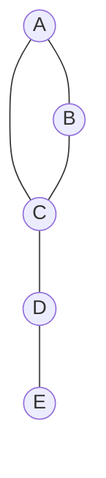
- V = {A, B, C, D, E}
- E = {AB, AC, BC, CD, DE}

**Sub-Graph G':**
```mermaid
graph TD
    A((A)) --- C((C))
    C --- D((D))
```
- V' = {A, C, D} ⊆ V
- E' = {AC, CD} ⊆ E
- G' ⊆ G

---

## Topic 14: Component

### Concept Explanation
- A **component** of a graph is a sub-graph which is **maximally connected**
- A graph that has **multiple components** is a **disconnected** graph

**Visual Example (2 Components):**

```mermaid
graph TD
    subgraph "Component 1"
        0((0)) --- 1((1))
        1 --- 2((2))
        0 --- 2
    end
    
    subgraph "Component 2"
        3((3)) --- 4((4))
        4 --- 5((5))
        3 --- 5
    end
```

**Analysis:**
- Total vertices: 6
- Component 1: {0, 1, 2}
- Component 2: {3, 4, 5}
- This is a **disconnected graph** (2 components)

---

## Topic 15: Tree

### Properties
1. **Acyclic** - no cycles
2. **Connected** - path exists between all vertex pairs
3. Each node has **exactly one parent** (except for root which has no parent)

**Visual Example:**

```mermaid
graph TD
    root((Root)) --> A((A))
    root --> B((B))
    A --> C((C))
    A --> D((D))
    B --> E((E))
```

**Tree Properties Verified:**
- ✓ Acyclic (no cycles)
- ✓ Connected (all nodes reachable from root)
- ✓ Each non-root has exactly one parent

### Related Concepts
- **DAG**: Directed Acyclic Graph (directed, acyclic, but may not satisfy tree properties)

```mermaid
graph TD
    A((A)) --> B((B))
    A --> C((C))
    B --> D((D))
    C --> D
```
**DAG (Not a Tree):** Node D has 2 parents (B and C)

---

## Topic 16: Spanning Tree

### Concept Explanation
- A **spanning tree** of a connected graph is a sub-graph which:
  - Is a **tree**
  - **Contains all the vertices** of the graph

### Visual Example

**Original Graph:**
```mermaid
graph TD
    A((A)) --- B((B))
    A --- C((C))
    B --- C
    B --- D((D))
    C --- D
```
- 4 vertices, 5 edges

**Possible Spanning Trees:**

**Spanning Tree 1:**
```mermaid
graph TD
    A((A)) --- B((B))
    A --- C((C))
    B --- D((D))
```

**Spanning Tree 2:**
```mermaid
graph TD
    A((A)) --- B((B))
    B --- C((C))
    C --- D((D))
```

**Spanning Tree 3:**
```mermaid
graph TD
    A((A)) --- C((C))
    B((B)) --- D((D))
    C --- D
```

### Properties
- A spanning tree of a graph with n vertices has exactly **n-1 edges**
- Multiple spanning trees can exist for a single graph (construction depends on choices)

### Spanning Forest
- Collection of spanning trees for a **disconnected graph**
- Each component gets its own spanning tree

```
┌─────────────────────────────────────────────────────┐
│  Construction of Spanning Tree = Choice-dependent  │
│                                                     │
│  For n vertices: Spanning Tree has (n-1) edges     │
│                                                     │
│  "Spanning Forest" = Spanning trees for            │
│                      disconnected graphs           │
└─────────────────────────────────────────────────────┘
```

---

## Practice Problems

### Graph Basics & Representation (Topics 1-9)

| Problem | Platform | Difficulty | Relevant Topics |
|---------|----------|------------|-----------------|
| [Find if Path Exists in Graph](https://leetcode.com/problems/find-if-path-exists-in-graph/) | LeetCode 1971 | Easy | Graph traversal, Adjacency List |
| [Find Center of Star Graph](https://leetcode.com/problems/find-center-of-star-graph/) | LeetCode 1791 | Easy | Graph basics, Degree |
| [Graph Representation (Adjacency List)](https://www.geeksforgeeks.org/graph-and-its-representations/) | GFG | Tutorial | Adjacency List, Adjacency Matrix |

### Connected Components (Topics 10-14)

| Problem | Platform | Difficulty | Relevant Topics |
|---------|----------|------------|-----------------|
| [Number of Connected Components in Undirected Graph](https://leetcode.com/problems/number-of-connected-components-in-an-undirected-graph/) | LeetCode 323 | Medium | Components, DFS/BFS, Union-Find |
| [Number of Provinces](https://leetcode.com/problems/number-of-provinces/) | LeetCode 547 | Medium | Connected Components |
| [Number of Islands](https://leetcode.com/problems/number-of-islands/) | LeetCode 200 | Medium | Grid as Graph, Components |

### Cycle Detection (Topic 11)

| Problem | Platform | Difficulty | Relevant Topics |
|---------|----------|------------|-----------------|
| [Redundant Connection](https://leetcode.com/problems/redundant-connection/) | LeetCode 684 | Medium | Cycle Detection, Union-Find |
| [Detect Cycle in Undirected Graph](https://www.geeksforgeeks.org/detect-cycle-undirected-graph/) | GFG | Medium | Cycle, DFS |

### Strongly Connected Components (Topic 12)

| Problem | Platform | Difficulty | Relevant Topics |
|---------|----------|------------|-----------------|
| [Critical Connections in a Network](https://leetcode.com/problems/critical-connections-in-a-network/) | LeetCode 1192 | Hard | Bridges, Tarjan's Algorithm |
| [Kosaraju's Algorithm](https://www.geeksforgeeks.org/strongly-connected-components/) | GFG | Tutorial | SCC, Kosaraju |

### Trees & Spanning Trees (Topics 15-16)

| Problem | Platform | Difficulty | Relevant Topics |
|---------|----------|------------|-----------------|
| [Min Cost to Connect All Points](https://leetcode.com/problems/min-cost-to-connect-all-points/) | LeetCode 1584 | Medium | Minimum Spanning Tree, Prim/Kruskal |
| [Connecting Cities With Minimum Cost](https://leetcode.com/problems/connecting-cities-with-minimum-cost/) | LeetCode 1135 | Medium | MST |
| [Graph Valid Tree](https://leetcode.com/problems/graph-valid-tree/) | LeetCode 261 | Medium | Tree validation, Acyclic + Connected |

### Recommended Learning Path

```
1. Graph Basics → LeetCode 1971 (Easy)
2. Components   → LeetCode 547 (Medium)
3. Cycle        → LeetCode 684 (Medium)  
4. Spanning Tree → LeetCode 1584 (Medium)
5. Advanced     → LeetCode 1192 (Hard)
```

