# Lecture 43 - Graphs

**Source:** `L43 - Graphs.pdf`

---

## Topic 1: Reachability in Graphs

**Problem Link:** [LeetCode 1971: Find if Path Exists in Graph](https://leetcode.com/problems/find-if-path-exists-in-graph/)

### Concept Explanation
**Problem Statement:** Given a **connected** graph and a **source** vertex, design an algorithm to find all the vertices **reachable** from the source vertex.

**Definition:** A vertex "v" in the graph is said to be **reachable** from vertex "u" if there exists a **path** from vertex "u" to vertex "v".

### Visual Examples (Hand-Drawn Reconstruction)

**The Lecture's 9-Node Diamond Grid Graph:**

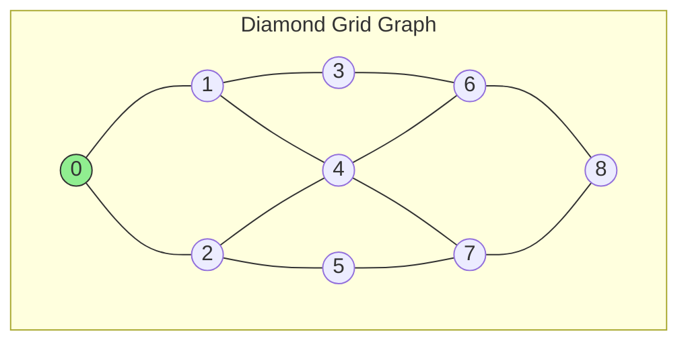

**ASCII Grid Layout (Exact from Slide):**
```
         (0) ← src/root
        /   \
      (1)   (2)
      /|\   /|\
    (3)-(4)-(5)
      \|/ \|/
      (6)   (7)
        \   /
         (8)
```

**Reachability Examples from Lecture:**
- Input set circled: `{0, 1, 2, 3, 4}` 
- Full output: `{0, 1, 2, 3, 4, 5}`

---

## Topic 2: Depth First Search (DFS)

**Problem Links:**
- [LeetCode 200: Number of Islands](https://leetcode.com/problems/number-of-islands/) (DFS on Grid)
- [GFG: Depth First Search or DFS for a Graph](https://www.geeksforgeeks.org/depth-first-search-or-dfs-for-a-graph/)

**Instructor Code:**
- [001Graphs_Search.cpp](../../instructor_code/Lecture%2043/001Graphs_Search.cpp) - DFS Implementation

**My Practice Code:**
- [1.dfs.cpp](../../user_practice_code/CB/LEC43/1.dfs.cpp)

<details>
<summary>View Code: DFS Implementation</summary>

```cpp
void dfs(int cur, const vector<vector<int>>& adj, vector<bool>& vis) {
  vis[cur] = true;
  cout << cur << " ";

  for (int ngb : adj[cur]) {
    if (!vis[ngb]) {
      dfs(ngb, adj, vis);
    }
  }
}
```

</details>

### Concept Explanation
**Key Idea:** The key idea behind the **DFS algorithm** is that for any vertex "u" in the graph, when you visit one of its unvisited neighbors, say "v", then first you visit all the **unvisited vertices reachable from "v"** before you visit the other unvisited neighbors of "u".

### Adjacency List (Hand-Written from Lecture)

```
┌─────┬───────────────┐
│  V  │   Neighbors   │
├─────┼───────────────┤
│  0  │  [1, 2]       │
│  1  │  [0, 3, 4]    │
│  2  │  [0, 4, 5]    │
│  3  │  [1, 6]       │
│  4  │  [1, 2, 6, 7] │
│  5  │  [2, 7]       │
│  6  │  [3, 4, 8]    │
│  7  │  [4, 5, 8]    │
│  8  │  [6, 7]       │
└─────┴───────────────┘
```

### Step-by-Step Algorithm Trace

**Visited Array Progression:**
```
Step 0 (Initial):
Index:  0   1   2   3   4   5   6   7   8
      ┌───┬───┬───┬───┬───┬───┬───┬───┬───┐
Vis:  │   │   │   │   │   │   │   │   │   │
      └───┴───┴───┴───┴───┴───┴───┴───┴───┘

After DFS completes:
Index:  0   1   2   3   4   5   6   7   8
      ┌───┬───┬───┬───┬───┬───┬───┬───┬───┐
Vis:  │ t │ t │ t │ t │ t │ t │ t │ t │ t │
      └───┴───┴───┴───┴───┴───┴───┴───┴───┘
```

**DFS Traversal Order (Exact from Lecture):**
```
0 → 1 → 3 → 6 → 4 → 2 → 5 → 7 → 8
```

**Sequence Breakdown:**
| Step | Current | Action | Visited Set |
|------|---------|--------|-------------|
| 1 | 0 | Start, visit 0 | {0} |
| 2 | 1 | Go to neighbor 1 | {0,1} |
| 3 | 3 | Go deep to 3 | {0,1,3} |
| 4 | 6 | Go deep to 6 | {0,1,3,6} |
| 5 | 4 | Neighbor of 6 | {0,1,3,6,4} |
| 6 | 2 | Neighbor of 4 | {0,1,3,6,4,2} |
| 7 | 5 | Neighbor of 2 | {0,1,3,6,4,2,5} |
| 8 | 7 | Backtrack, go to 7 | {0,1,3,6,4,2,5,7} |
| 9 | 8 | Finally reach 8 | {0,1,3,6,4,2,5,7,8} |

### DFS Tree & Back Edges (Visual Reconstruction)

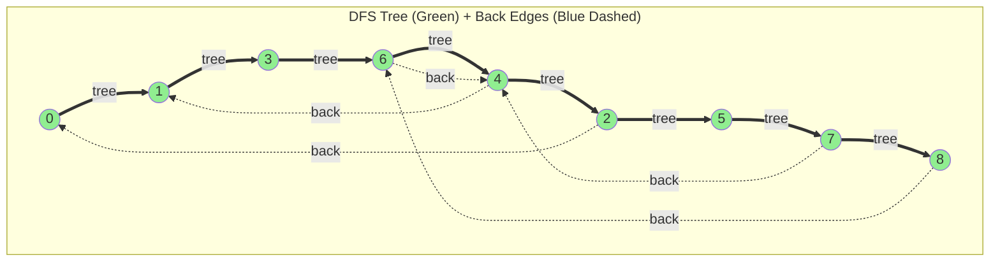

**Handwritten Diagram from Page 2:**
```
            ┌─────────────────────────────────────────┐
            │              DFS-TREE                    │
     ┌──────┼──────┐                                   │
     ▼      │      ▼                                   │
    (0)────►(1)───►(3)───►(6)───►(4)───►(2)           │
     │             │       │      │      │            │
     │             │       ▼      ▼      ▼            │
     │             └─────►(4)    (7)───►(8)           │
     │                            │                    │
     │              BACK EDGES    ▼                    │
     └────────────────────────────┘                    │
           (Blue dashed arrows)                        │
└─────────────────────────────────────────────────────┘
```

### Key Insights (From Lecture Notes)
- **"If a graph has a backedge then it means gr. has a cycle"**
- **Spanning Tree:** An edge present in the graph but NOT in the spanning tree built by DFS/BFS
- **o/p of dfs is not unique** - it depends on how you process the neighbor list

---

## Topic 3: Breadth First Search (BFS)

**Problem Links:**
- [LeetCode 102: Binary Tree Level Order Traversal](https://leetcode.com/problems/binary-tree-level-order-traversal/) (BFS Pattern)
- [LeetCode 994: Rotting Oranges](https://leetcode.com/problems/rotting-oranges/) (Multi-source BFS)
- [GFG: Breadth First Search or BFS for a Graph](https://www.geeksforgeeks.org/breadth-first-search-or-bfs-for-a-graph/)

**Instructor Code:**
- [001Graphs_Search2.cpp](../../instructor_code/Lecture%2043/001Graphs_Search2.cpp) - BFS Implementation

**My Practice Code:**
- [2-bfs.cpp](../../user_practice_code/CB/LEC43/2-bfs.cpp)

### Concept Explanation
**Key Idea:** The key idea behind the **BFS algorithm** is that, for any vertex "u" in the graph, you've to first visit all of its **unvisited neighbors** before you visit the **neighbors of its neighbors**.

### BFS Level Structure (From Lecture)

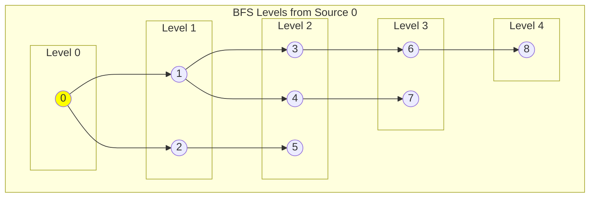

**ASCII Level Diagram (Exact from Slide):**
```
Level 0:         (0) ← root
                /   \
Level 1:      (1)   (2)
              /|\   /|\
Level 2:    (3)-(4)-(5)
              \|/ \|/
Level 3:      (6)   (7)
                \   /
Level 4:         (8)
```

### BFS Implementation - State Visualization

**Data Structures:**
1. **Queue** - nodes visited but not yet explored
2. **Set/Map** - nodes that have been visited

**Queue State Trace (From Lecture):**
```
┌─────────────────────────────────────────────────────────┐
│ Queue: │ 0 │ 1 │ 2 │ 3 │ 4 │ 5 │ 6 │ 7 │ 8 │           │
│        │ ✓ │ ✓ │ ✓ │ ✓ │ ✓ │ ✓ │ ✓ │ ✓ │ ✓ │           │
│          ↑                                              │
│         src                                             │
└─────────────────────────────────────────────────────────┘
```

**Visited Array State:**
```
Index:  0   1   2   3   4   5   6   7   8
      ┌───┬───┬───┬───┬───┬───┬───┬───┬───┐
Vis:  │ t │ t │ t │ t │ t │ t │ t │ t │ t │
      └───┴───┴───┴───┴───┴───┴───┴───┴───┘
```

**BFS Tree with Cross Edges (Hand-Drawn):**
```
                (0)
               /   \
             (1)   (2)
             / \   / \
           (3) (4) (5)    ← "bfs-tree" label
           /     \ /
         (6)     (7)
           \     /
            (8)
              ↓
         "Backedges" (cross-level connections)
```

---

## Topic 4: Graph Traversal (Connected Components)

**Problem Links:**
- [LeetCode 547: Number of Provinces](https://leetcode.com/problems/number-of-provinces/)
- [LeetCode 323: Number of Connected Components in an Undirected Graph](https://leetcode.com/problems/number-of-connected-components-in-an-undirected-graph/)

**Instructor Code:**
- [002Graphs_Traverse.cpp](../../instructor_code/Lecture%2043/002Graphs_Traverse.cpp) - Graph Traversal & Component Counting

**My Practice Code:**
- [3.traversal-dfs.cpp](../../user_practice_code/CB/LEC43/3.traversal-dfs.cpp)

### Concept Explanation
To traverse a **disconnected graph**, iterate through all vertices `0` to `N-1`. If a vertex is unvisited, start a traversal (DFS/BFS) from it to discover its connected component.

### State Visualization (From Lecture Page 4)

**Visited Array with Component Markers:**
```
Index:  0   1   2   3   4   5   6   7   8   9  10  11  12  13  14  15
      ┌───┬───┬───┬───┬───┬───┬───┬───┬───┬───┬───┬───┬───┬───┬───┬───┐
Vis:  │ t │ t │ t │ t │ t │ t │ t │ t │ t │ t │ t │ t │ t │ t │ t │ t │
      └───┴───┴───┴───┴───┴───┴───┴───┴───┴───┴───┴───┴───┴───┴───┴───┘
        ↑                       ↑                       ↑
       [0] Start              [7] Start               [12] Start
        └───────┬───────────────┴───────┬───────────────┴────┘
           Component 1            Component 2           Component 3
```

**Arrows in Lecture:** Points at indices 0, 7, and 12 showing where new traversals began.

### Component Graph Structures (Exact from Lecture)

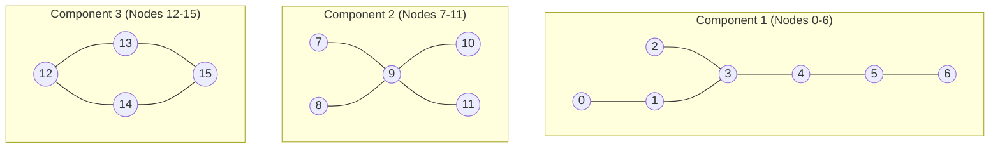

**ASCII Layout (From Slide):**
```
┌─────────────────────────────────────────────────────────┐
│  Component 1       Component 2         Component 3     │
│                                                         │
│    (0)   (1)         (7)   (8)           (12)          │
│      \ /   \           \ /               /  \          │
│    (2) ✓  (3)  (4)      (9) ✓         (13)  (14)       │
│            \  /        / \              \  /           │
│    (5)     (6)      (10) (11)           (15)           │
│                                                         │
│   ✓ = starting point of traversal                      │
└─────────────────────────────────────────────────────────┘
```

---

## Topic 5: Cycle Detection (Undirected Graph)

**Problem Links:**
- [LeetCode 684: Redundant Connection](https://leetcode.com/problems/redundant-connection/)
- [GFG: Detect Cycle in an Undirected Graph](https://www.geeksforgeeks.org/detect-cycle-undirected-graph/)

**Instructor Code:**
- [003Graphs_DetectCycle.cpp](../../instructor_code/Lecture%2043/003Graphs_DetectCycle.cpp) - Cycle Detection (Using Parent Check)

**My Practice Code:**
- [4-detect-cycle.cpp](../../user_practice_code/CB/LEC43/4-detect-cycle.cpp)

### Concept Explanation
**Problem Statement:** Given an **undirected** graph, design an algorithm to check if it contains a **cycle**.

**Algorithm:** During traversal, if we encounter a neighbor that is:
1. Already **visited**, AND
2. **NOT the parent** (the node we came from)

→ Then a **cycle exists**.

### Visual Walkthroughs (Exact from Lecture)

**Case 1: Tree Structure → No Cycle (FALSE)**

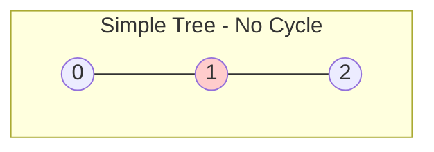

```
     (1)
    /   \
  (0)   (2)
  
  Result: FALSE (No cycle)
          FALSE
```

**Trace:**
- Path: `0 → 1 → 2`
- At node 2, neighbor 1 is visited
- Is 1 the parent? **YES** (we came from 1)
- No cycle detected

---

**Case 2: Diamond Structure → Cycle Present (TRUE)**

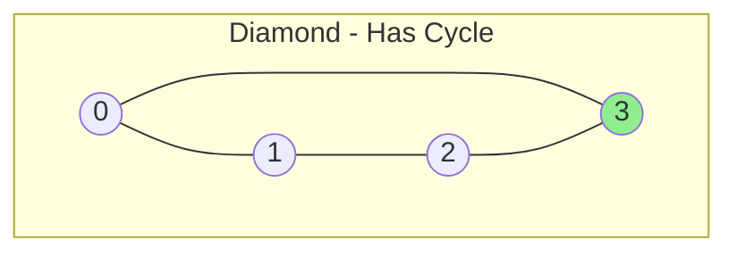

```
      (1)
     /   \
   (0)   (2)
     \   /
      (3)
      
  Result: TRUE (Cycle detected!)
```

**Trace:**
- Path: `0 → 1 → 2 → 3`
- At node 3, neighbor 0 is visited
- Is 0 the parent (which is 2)? **NO**
- **CYCLE DETECTED!**

---

**Case 3: Linear Chain (From right side of slide)**

```
  (0)         (0)
   |           |
  (1)    or   (1)
   |           
  (2)         
   |           
  (3)        
  
  Result: FALSE (just a path)
```

---

## Topic 6: Bipartite Graph (2-Coloring Problem)

**Problem Link:** [LeetCode 785: Is Graph Bipartite?](https://leetcode.com/problems/is-graph-bipartite/)

### Concept Explanation
**Problem Statement:** Given an **undirected** graph, design an algorithm to check if it is a **Bipartite** graph.

**Definition:** A graph is said to be a **Bipartite** graph if the graph nodes can be **partitioned** into **two independent sets** A and B such that each edge in the graph connects a node in set A and a node in set B.

**Alternative Name:** 2-Coloring Problem

### Visual Examples (From Lecture)

**Example 1: Pentagon with Tail → Initially TRUE, then FALSE**

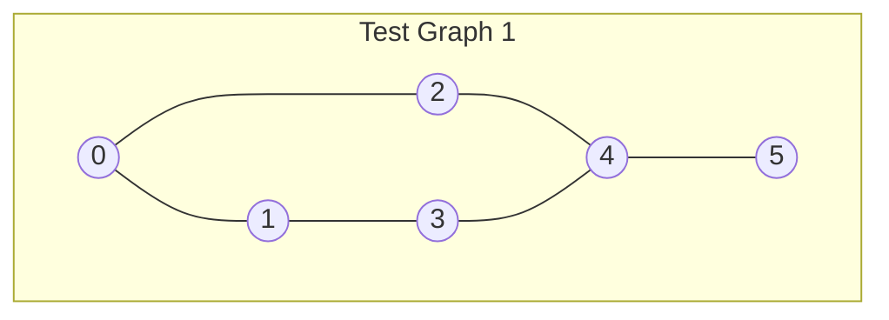

```
         B(0)
        /   \
      A(1)   A(2)
        \   /
        B(3)---A(4)
              |
             B(5)

Coloring Attempt:
  Set A: {1, 2, 4}
  Set B: {0, 3, 5}
  
  Result: TRUE (corrected to FALSE due to odd cycle)
          FALSE
```

**Partition Visualization (Hand-Drawn):**
```
    A          B
  ┌───┐      ┌───┐
  │ 0 │──────│ 1 │
  │ 3 │╲    ╱│ 2 │
  │ 4 │ ╲  ╱ │   │
  │ 5 │  ╲╱  │   │
  └───┘      └───┘
     Crossing lines = edges
```

---

**Example 2: Square → TRUE (Bipartite)**

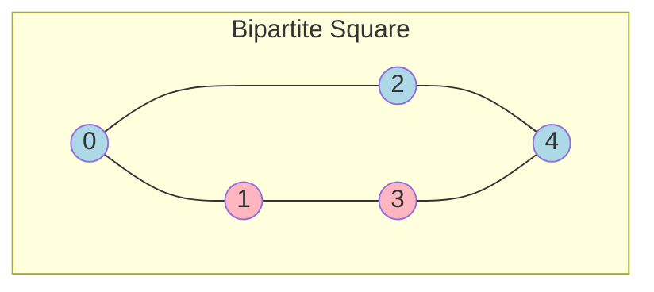

```
       B(0)
      /   \
    A(1)   B(2)
      |     |
    A(3)---B(4)
    
  Set A: {1, 3}
  Set B: {0, 2, 4}
  
  Result: TRUE
```

**Partition Lines:**
```
    A      B
  ┌───┐  ┌───┐
  │ 0 │──│ 1 │
  │ 2 │╲╱│ 3 │
  └───┘  └───┘
```

---

**Example 3: Conflict Detection (??)**

```
       (0)
      /   \
    (1)   (2) ?? ← conflict
      \   /
       (4)   → B
       
  Shows odd cycle causing conflict
```

---

## Topic 7: Clone Graph (Homework Problem)

**Problem Link:** [LeetCode 133: Clone Graph](https://leetcode.com/problems/clone-graph/)

### Problem Statement
Given reference of a node in a connected undirected graph, return a **deep copy** (clone) of the graph. Note that, each graph node contains a value (`int`) and a list (`List [ Node ]`) of its neighbors.

### Node Structure
```java
class Node {
    public int val;
    public List<Node> neighbors;
}
```

### Visual Representation (From Lecture)
```
┌─────────────────────────┐
│  Node                   │
│  ┌───────┬───────────┐  │
│  │  val  │ neighbors │  │
│  │       │  ┌─┐ ┌─┐  │  │
│  │       │  │→│ │→│  │  │
│  │       │  └─┘ └─┘  │  │
│  └───────┴───────────┘  │
└─────────────────────────┘
```

---

## Topic 8: Back Edge Detection (Directed Graph)

**Problem Links:**
- [LeetCode 207: Course Schedule](https://leetcode.com/problems/course-schedule/) (Cycle in Directed Graph)
- [LeetCode 210: Course Schedule II](https://leetcode.com/problems/course-schedule-ii/) (Topological Sort)

**Instructor Code:**
- [004Graphs_BackEdge.cpp](../../instructor_code/Lecture%2043/004Graphs_BackEdge.cpp) - Back Edge Detection (Using Recursion Stack)

**My Practice Code:**
- [5-back-edge-detection.cpp](../../user_practice_code/CB/LEC43/5-back-edge-detection.cpp)

### Concept Explanation
**Problem Statement:** Given a **directed** graph, design an algorithm to check if it contains a **back-edge**.

**Definition:** A directed edge `u → v` is said to be a **back-edge** if there exists a **directed path** from vertex **v** to vertex **u**.

```
       u ───→ v
       ↑      │
       └──────┘
     (back-edge)
```

### Visual Examples (From Lecture Page 8)

**Example 1: Simple Tree → No Back Edge**

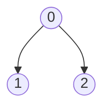

```
      (0)  ✓
     ↙   ↘
   (1)    (2)
    ✓       ✓
    
  exp o/p: false
  b/p: true (meaning: correctly no back edge)
```

---

**Example 2: Triangle with Cycle → Back Edge Present**

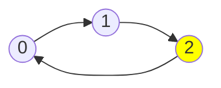

```
      (0) ✓
     ↙   ↖
   (1) → (2) ✓
     ✓
     
  exp: o/p: true  } "wrong" annotation
  o/p: false      }
```

---

### Algorithm: Using Recursion Stack

**Key Insight:** Check if we reach a node that is currently in the **Recursion Stack** (current DFS path).

**Visual Trace for Cycle: 0 → 1 → 2 → 3 → 1**

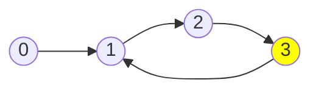

### Recursion Stack Visualization (Exact from Lecture)

```
┌───────────────────────────────────────────┐
│            Recursion Stack                │
│                                           │
│    ┌─────────┐                            │
│    │ dfs(3)  │ ──→ Neighbor 1?            │
│    ├─────────┤     1 is in stack!         │
│    │ dfs(2)  │     (Back Edge Detected!)  │
│    ├─────────┤                            │
│    │ dfs(1)  │                            │
│    ├─────────┤                            │
│    │ dfs(0)  │                            │
│    └─────────┘                            │
│                                           │
│    Stack Contents: {0, 1, 2, 3}           │
└───────────────────────────────────────────┘
```

**Step-by-Step Trace:**

| Step | Action | Stack State | Check |
|------|--------|-------------|-------|
| 1 | dfs(0) | [0] | - |
| 2 | dfs(1) | [0, 1] | - |
| 3 | dfs(2) | [0, 1, 2] | - |
| 4 | dfs(3) | [0, 1, 2, 3] | Neighbor = 1 |
| 5 | **Check** | **1 ∈ stack!** | **BACK EDGE!** |

**Additional Diagram (Triangle with ??)**
```
    (0)
   ↙   ↘
 (3)    (1)
   ↖   ↙
    (2) ??
    
  Shows conflict in cycle detection
```

**Stack Unwinding Visualization:**
```
After detection:
  dfs(3) ━━━━━╸ returns TRUE
  dfs(2) ━━━━━╸ returns TRUE
  dfs(1) ━━━━━╸ propagates
  dfs(0)
```

---

## Summary of Key Concepts

| Topic | Algorithm | Key Data Structure | Cycle Condition |
|-------|-----------|-------------------|-----------------|
| Reachability | DFS/BFS | Visited Set | N/A |
| DFS | Recursive/Stack | Stack + Visited | Back edge → cycle |
| BFS | Iterative | Queue + Visited | Cross edge analysis |
| Traversal | Loop + DFS/BFS | Visited Array | N/A |
| Cycle (Undirected) | DFS with parent | Parent tracking | visited ∧ ¬parent |
| Bipartite | 2-coloring BFS | Color array | Odd cycle → false |
| Clone Graph | DFS + HashMap | Old→New mapping | N/A |
| Back Edge (Directed) | DFS + rec stack | Recursion stack | node ∈ stack → cycle |
