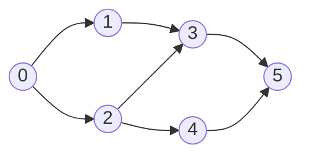
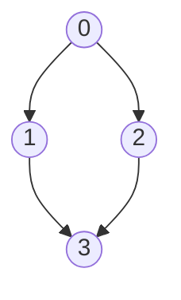
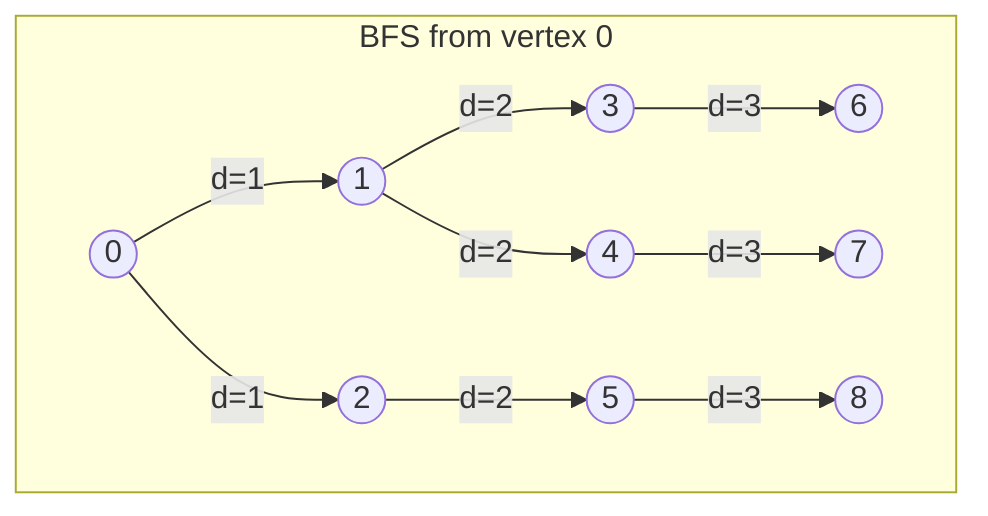
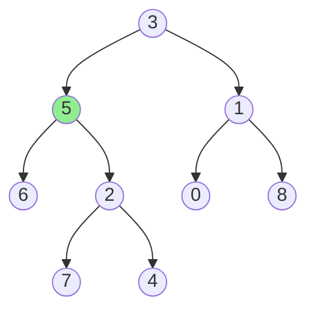

# Lecture 44 - Graphs: Grid Problems & Topological Sort

**Source:** `L44 - Graphs.pdf`

---

## Page 1: Max Area of Island

### Problem Statement
Given a 2D grid of `0`s (water) and `1`s (land), find the **maximum area** of an island.
- Island = group of `1`s connected 4-directionally
- Area = count of `1`s in the island

### Example

```
Input:                          Islands found:
┌─┬─┬─┬─┬─┬─┬─┬─┐              ┌─┬─┬─┬─┬─┬─┬─┬─┐
│0│0│1│0│0│0│0│1│              │ │ │█│ │ │ │ │█│
├─┼─┼─┼─┼─┼─┼─┼─┤              ├─┼─┼─┼─┼─┼─┼─┼─┤
│0│0│0│0│0│0│1│1│              │ │ │ │ │ │ │█│█│
├─┼─┼─┼─┼─┼─┼─┼─┤              ├─┼─┼─┼─┼─┼─┼─┼─┤
│0│1│1│0│1│0│0│0│   →          │ │▓│▓│ │▒│ │ │ │
├─┼─┼─┼─┼─┼─┼─┼─┤              ├─┼─┼─┼─┼─┼─┼─┼─┤
│0│1│0│0│1│1│0│0│              │ │▓│ │ │▒│▒│ │ │
├─┼─┼─┼─┼─┼─┼─┼─┤              ├─┼─┼─┼─┼─┼─┼─┼─┤
│0│1│0│0│1│1│0│0│              │ │▓│ │ │▒│▒│ │ │
└─┴─┴─┴─┴─┴─┴─┴─┘              └─┴─┴─┴─┴─┴─┴─┴─┘

Output: 6 (the ▒ island)
```

### Algorithm: DFS/BFS from each unvisited `1`

```python
def maxAreaOfIsland(grid):
    dx = [0, 0, -1, 1]  # directions
    dy = [-1, 1, 0, 0]
    max_area = 0
    
    def dfs(i, j):
        if i < 0 or j < 0 or i >= m or j >= n or grid[i][j] == 0:
            return 0
        grid[i][j] = 0  # mark visited
        area = 1
        for k in range(4):
            area += dfs(i + dx[k], j + dy[k])
        return area
    
    for i in range(m):
        for j in range(n):
            if grid[i][j] == 1:
                max_area = max(max_area, dfs(i, j))
    
    return max_area
```

---

## Page 2: Making a Largest Island

### Problem Statement
Given a grid of `0`s and `1`s, you can change **at-most one** `0` to `1`.
Find the **maximum area** of an island after this change.

### Example

```
Input:                    Output: 11
1 0 0 1 0             
1 0 1 0 0             By changing (0,1) to 1:
0 0 1 0 1             Connect two islands!
1 0 1 1 1
1 0 1 1 0
```

### Approach
1. Use DFS to find all islands and their sizes
2. Label each island with a unique ID
3. For each `0`, check which islands it would connect
4. Return max possible area

---

## Page 3: Topological Sorting of a DAG

### What is Topological Sort?
A **linear ordering** of vertices in a **Directed Acyclic Graph (DAG)** such that for every edge `u → v`, vertex `u` comes before `v`.



**One valid topological order:** `0 → 1 → 2 → 3 → 4 → 5`

### BFS Implementation (Kahn's Algorithm)

```python
def topological_sort_bfs(graph, n):
    in_degree = [0] * n
    for u in graph:
        for v in graph[u]:
            in_degree[v] += 1
    
    queue = deque([v for v in range(n) if in_degree[v] == 0])
    result = []
    
    while queue:
        u = queue.popleft()
        result.append(u)
        for v in graph[u]:
            in_degree[v] -= 1
            if in_degree[v] == 0:
                queue.append(v)
    
    return result if len(result) == n else []  # Empty = cycle exists
```

### DFS Implementation

```python
def topological_sort_dfs(graph, n):
    visited = [False] * n
    stack = []
    
    def dfs(u):
        visited[u] = True
        for v in graph[u]:
            if not visited[v]:
                dfs(v)
        stack.append(u)  # Add AFTER processing all neighbors
    
    for v in range(n):
        if not visited[v]:
            dfs(v)
    
    return stack[::-1]  # Reverse for topological order
```

### Cycle Detection
If BFS doesn't visit all vertices → cycle exists (no valid topological order).

---

## Page 4-5: Course Schedule II

### Problem Statement
There are `n` courses labeled `0` to `n-1`. Given prerequisites where `[a, b]` means you must take course `b` before course `a`.

Return any valid order to finish all courses, or empty array if impossible.

### Example

```
numCourses = 4
prerequisites = [[1,0], [2,0], [3,1], [3,2]]

Course dependency graph:
```



**Output:** `[0, 1, 2, 3]` or `[0, 2, 1, 3]`

---

## Page 6: Alien Dictionary

### Problem Statement
Given a list of words sorted in **alien language** order, determine the order of characters.

### Example

```
Input: ["wrt", "wrf", "er", "ett", "rftt"]

Compare adjacent words:
wrt < wrf  →  t < f
wrf < er   →  w < e  
er < ett   →  r < t
ett < rftt →  e < r

Build graph:
```


**Topological sort:** `w → e → r → t → f`

---

## Page 7: SSSP using BFS

### Single Source Shortest Path (SSSP) - Unweighted Graph

For **unweighted graphs**, BFS naturally finds shortest paths!



### Algorithm

```python
def sssp_bfs(graph, source, n):
    dist = [-1] * n
    dist[source] = 0
    queue = deque([source])
    
    while queue:
        u = queue.popleft()
        for v in graph[u]:
            if dist[v] == -1:  # Not visited
                dist[v] = dist[u] + 1
                queue.append(v)
    
    return dist
```

### Key Insight
BFS visits vertices in order of increasing distance from source.

---

## Page 8: Snakes and Ladders

### Problem Statement
Given an N×N Snakes & Ladders board with snakes and ladders at specific positions:
- Find **minimum dice throws** to reach cell N² from cell 1

### Example

```
N = 36
ladders = [(2,15), (5,7), (9,27), (18,29), (25,35)]
snakes = [(17,4), (20,6), (24,16), (32,30), (34,12)]

Output: 4 throws
```

```
Board Layout:
┌────┬────┬────┬────┬────┬────┐
│ 36 │ 35 │ 34 │ 33 │ 32 │ 31 │ ← Finish!
├────┼────┼────┼────┼────┼────┤
│ 25 │ 26 │ 27 │ 28 │ 29 │ 30 │
├────┼────┼────┼────┼────┼────┤
│ 24 │ 23 │ 22 │ 21 │ 20 │ 19 │
├────┼────┼────┼────┼────┼────┤
│ 13 │ 14 │ 15 │ 16 │ 17 │ 18 │
├────┼────┼────┼────┼────┼────┤
│ 12 │ 11 │ 10 │  9 │  8 │  7 │
├────┼────┼────┼────┼────┼────┤
│  1 │  2 │  3 │  4 │  5 │  6 │ ← Start
└────┴────┴────┴────┴────┴────┘
```

### Approach
Model as graph + BFS:
- Each cell is a node
- From cell `i`, you can reach cells `i+1` to `i+6` (dice values)
- If destination has ladder → jump to ladder end
- If destination has snake → fall to snake tail
- BFS finds shortest path (minimum throws)

---

## Page 10: All Nodes Distance K in Binary Tree

### Problem Statement
Given a binary tree, a **target** node, and integer **K**, return all nodes at distance K from target.

### Example



**Target = 5, K = 2**

**Output:** `[7, 4, 1]` (nodes at distance 2 from target 5)

### Approach
1. Convert tree to undirected graph (add parent pointers)
2. BFS from target node
3. Return all nodes at level K

```python
# Build parent map
def build_parent_map(root):
    parent = {}
    def dfs(node, par):
        if node:
            parent[node] = par
            dfs(node.left, node)
            dfs(node.right, node)
    dfs(root, None)
    return parent

# BFS from target
def distanceK(root, target, k):
    parent = build_parent_map(root)
    visited = set()
    queue = deque([(target, 0)])
    result = []
    
    while queue:
        node, dist = queue.popleft()
        if node in visited:
            continue
        visited.add(node)
        
        if dist == k:
            result.append(node.val)
        elif dist < k:
            for neighbor in [node.left, node.right, parent.get(node)]:
                if neighbor and neighbor not in visited:
                    queue.append((neighbor, dist + 1))
    
    return result
```

---

## Summary

| Problem | Algorithm | Time Complexity |
|---------|-----------|-----------------|
| Max Area of Island | DFS/BFS | O(m × n) |
| Making Largest Island | DFS + Union-Find | O(m × n) |
| Topological Sort (Kahn) | BFS | O(V + E) |
| Topological Sort (DFS) | DFS + Stack | O(V + E) |
| Course Schedule II | Topological Sort | O(V + E) |
| Alien Dictionary | Topological Sort | O(C) where C = total chars |
| SSSP (Unweighted) | BFS | O(V + E) |
| Snakes & Ladders | BFS | O(N²) |
| Distance K in Tree | BFS | O(N) |
