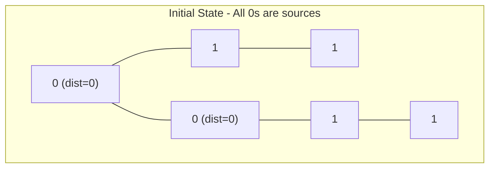
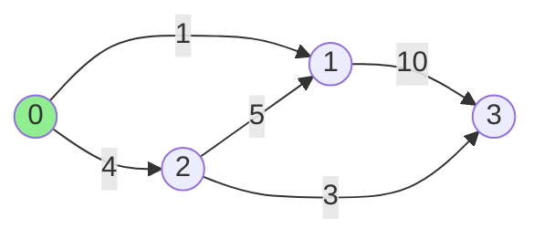
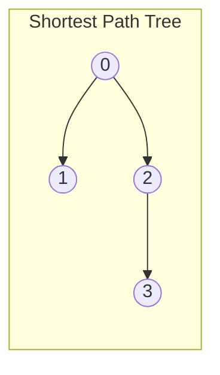
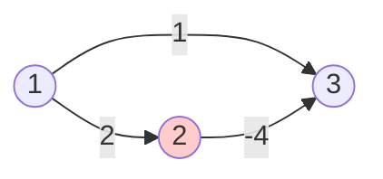
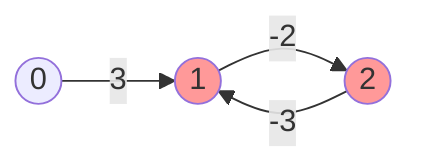
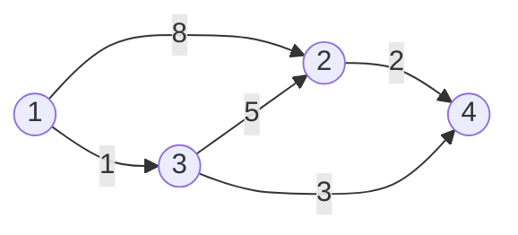

# Lecture 45 - Graphs: Shortest Path Algorithms

**Source:** `L45 - Graphs.pdf`

---

## Page 1: 01 Matrix Problem

### Problem Statement
Given an `m x n` binary matrix, find the **distance** to the nearest `0` for each cell.
- Distance is calculated using **Manhattan distance**: `|x₁ - x₂| + |y₁ - y₂|`

### Example

**Input:**
```
┌───┬───┬───┬───┐
│ 0 │ 0 │ 0 │ 1 │
├───┼───┼───┼───┤
│ 0 │ 1 │ 1 │ 1 │
├───┼───┼───┼───┤
│ 0 │ 1 │ 1 │ 1 │
├───┼───┼───┼───┤
│ 1 │ 1 │ 1 │ 1 │
└───┴───┴───┴───┘
```

**Output:**
```
┌───┬───┬───┬───┐
│ 0 │ 0 │ 0 │ 1 │
├───┼───┼───┼───┤
│ 0 │ 1 │ 1 │ 2 │
├───┼───┼───┼───┤
│ 0 │ 1 │ 2 │ 3 │
├───┼───┼───┼───┤
│ 1 │ 2 │ 3 │ 4 │
└───┴───┴───┴───┘
```

### Time Complexity Analysis
- Single BFS: `O(V + E)` where V = m×n, E ≈ 4×m×n
- Naive approach (BFS from each cell): `O(m×n × BFS)` = **O(m²n²)** worst case
- **Better approach: Multi-Source BFS** - start from ALL zeros simultaneously → **O(m×n)**

---

## Page 2: Multi-Source BFS Visualization



### Algorithm:
1. Add ALL cells with value `0` to the queue (distance = 0)
2. Perform standard BFS
3. Each cell gets its distance when first visited

---

## Page 3-4: Rotten Oranges Problem

### Problem Statement
Given an `m × n` grid where:
- `0` = empty cell
- `1` = fresh orange 🍊
- `2` = rotten orange 🦠

Every minute, fresh oranges **4-directionally adjacent** to rotten oranges become rotten.

**Return:** Minimum minutes until no fresh orange remains, or `-1` if impossible.

### Example Visualization

```
Minute 0:    Minute 1:    Minute 2:    Minute 3:    Minute 4:
🦠 🍊 🍊    🦠 🦠 🍊    🦠 🦠 🦠    🦠 🦠 🦠    🦠 🦠 🦠
🍊 🍊 ⬜    🦠 🍊 ⬜    🦠 🦠 ⬜    🦠 🦠 ⬜    🦠 🦠 ⬜
⬜ 🍊 🍊    ⬜ 🍊 🍊    ⬜ 🦠 🍊    ⬜ 🦠 🦠    ⬜ 🦠 🦠

Output: 4 minutes
```

### Solution: Multi-Source BFS
Same approach as 01 Matrix - start BFS from all rotten oranges simultaneously.

---

## Page 5-7: Dijkstra's Algorithm (SSSP)

### Single Source Shortest Path (SSSP)
Given a **weighted graph** and **source vertex**, find shortest path to ALL other vertices.



### Key Concepts

#### Tense Edge
An edge `(u, v)` is **tense** if: `d[v] > d[u] + weight(u,v)`

#### Edge Relaxation
```
if d[v] > d[u] + w(u,v):
    d[v] = d[u] + w(u,v)  # Relax the edge
```

### Dijkstra's Algorithm

```python
def dijkstra(graph, source):
    dist = {v: ∞ for v in graph}
    dist[source] = 0
    explored = set()
    min_heap = [(0, source)]  # (distance, vertex)
    
    while min_heap:
        d_u, u = heappop(min_heap)
        if u in explored:
            continue
        explored.add(u)
        
        for v, weight in graph[u]:
            if dist[v] > dist[u] + weight:
                dist[v] = dist[u] + weight  # Relax
                heappush(min_heap, (dist[v], v))
    
    return dist
```

### Data Structures Used:
| Structure | Purpose |
|-----------|---------|
| `dist` Map | Stores shortest distance from source |
| `explored` Set | Tracks fully processed vertices |
| `min_heap` | Selects next vertex with minimum distance |

### Path Construction
To reconstruct the actual path, maintain a `parent` map:



---

## Page 7: Dijkstra Limitations

### ⚠️ Dijkstra FAILS with Negative Edges



**Problem:** Dijkstra marks vertex as "explored" too early, missing better paths through negative edges.

### Negative Weight Cycle
If graph contains a **negative weight cycle**, shortest path is **undefined** (can go to -∞).



---

## Page 9-10: Bellman-Ford Algorithm

### When to Use Bellman-Ford
- Graph has **negative weight edges**
- Need to **detect negative weight cycles**

### Algorithm Idea
Relax ALL edges **V-1 times** (where V = number of vertices).

```python
def bellman_ford(graph, source, V):
    dist = {v: ∞ for v in range(V)}
    dist[source] = 0
    
    # Relax all edges V-1 times
    for _ in range(V - 1):
        for u, v, weight in edges:
            if dist[u] != ∞ and dist[v] > dist[u] + weight:
                dist[v] = dist[u] + weight
    
    # Check for negative cycle
    for u, v, weight in edges:
        if dist[u] != ∞ and dist[v] > dist[u] + weight:
            return "Negative cycle detected!"
    
    return dist
```

### Why V-1 iterations?
- Shortest path has at most **V-1 edges**
- In iteration `i`, we find shortest paths using at most `i` edges

### Detecting Negative Cycle
After V-1 iterations, if ANY edge can still be relaxed → **negative cycle exists**.

---

## Page 11-13: Floyd-Warshall Algorithm

### All-Pairs Shortest Path (APSP)
Find shortest path between **every pair** of vertices.



### Distance Matrix

**Initial (direct edges only):**
|   | 1 | 2 | 3 | 4 |
|---|---|---|---|---|
| 1 | 0 | 8 | 1 | ∞ |
| 2 | ∞ | 0 | ∞ | 2 |
| 3 | ∞ | 5 | 0 | 3 |
| 4 | ∞ | ∞ | ∞ | 0 |

**After Floyd-Warshall:**
|   | 1 | 2 | 3 | 4 |
|---|---|---|---|---|
| 1 | 0 | 6 | 1 | 4 |
| 2 | 6 | 0 | 5 | 2 |
| 3 | 1 | 5 | 0 | 3 |
| 4 | 4 | 2 | 3 | 0 |

### Algorithm (Dynamic Programming)

```python
def floyd_warshall(dist, V):
    # dist[i][j] = direct edge weight or ∞
    
    for k in range(V):        # Intermediate vertex
        for i in range(V):    # Source
            for j in range(V): # Destination
                if dist[i][k] + dist[k][j] < dist[i][j]:
                    dist[i][j] = dist[i][k] + dist[k][j]
    
    return dist
```

### Key Insight
`dist[i][j]` through vertex `k` = `dist[i][k] + dist[k][j]`

```
     i ---------> j        vs       i ---> k ---> j
      (direct)                     (through k)
```

### Detecting Negative Cycle
If `dist[i][i] < 0` for any vertex → negative cycle exists.

---

## Summary: Shortest Path Algorithms

| Algorithm | Problem | Handles Negative Weights? | Time Complexity |
|-----------|---------|---------------------------|-----------------|
| **BFS** | Unweighted SSSP | N/A | O(V + E) |
| **Dijkstra** | Weighted SSSP | ❌ No | O((V + E) log V) |
| **Bellman-Ford** | Weighted SSSP | ✅ Yes (detects cycles) | O(V × E) |
| **Floyd-Warshall** | All-Pairs SP | ✅ Yes (detects cycles) | O(V³) |

### When to Use What:
- **Unweighted graph** → BFS
- **Non-negative weights** → Dijkstra (fastest)
- **Negative weights, no negative cycles** → Bellman-Ford
- **All pairs + negative weights** → Floyd-Warshall
